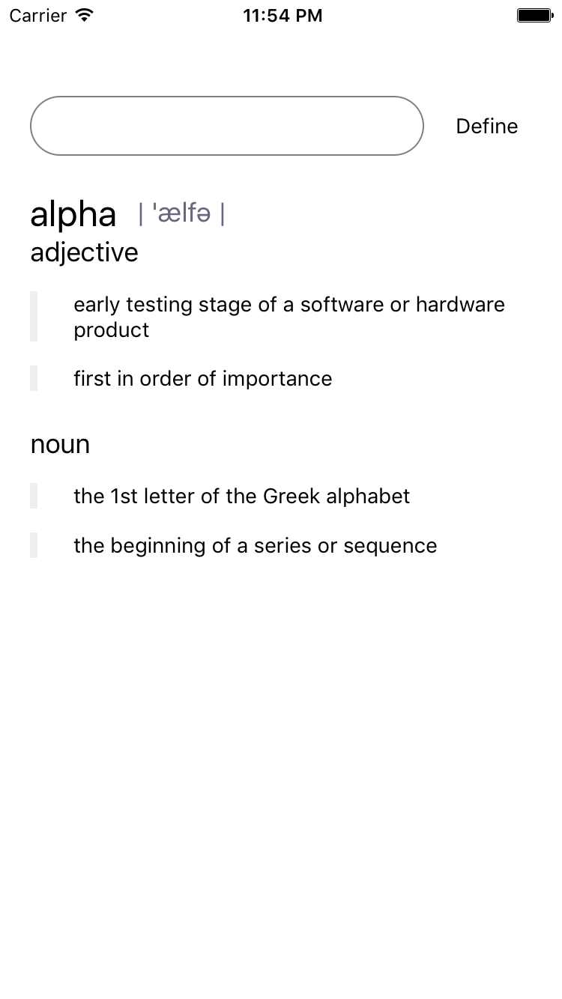

Sic.
====

Sic. is a standalone dictionary app for iOS written with React Native. The dictionary app in OS X is good and this is a quick attempt to emulate it.

iOS has an on-disk (or something) dictionary but doesn't expose it for standalone apps. Wrapping that API/View in a React component didn't prove very useful anyway.

This uses https://www.wordsapi.com, which requires an API key. You can set this in `Dictionary.js` with `API_KEY`.

